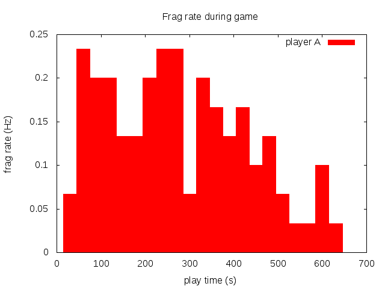
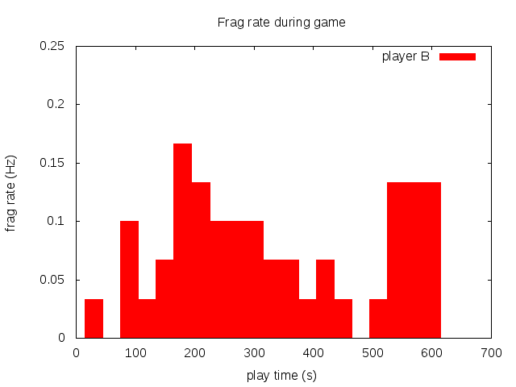
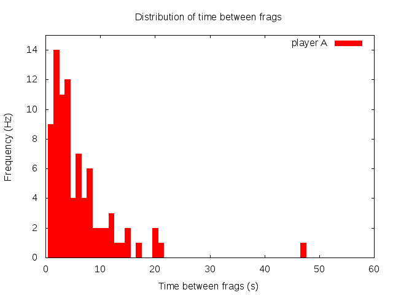
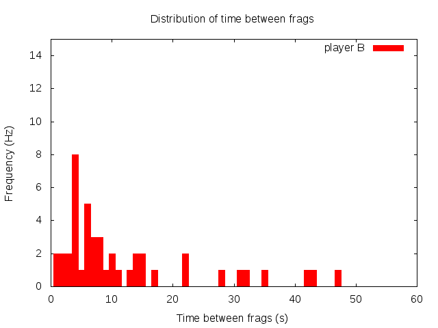
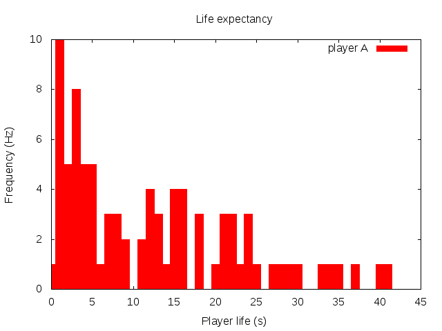
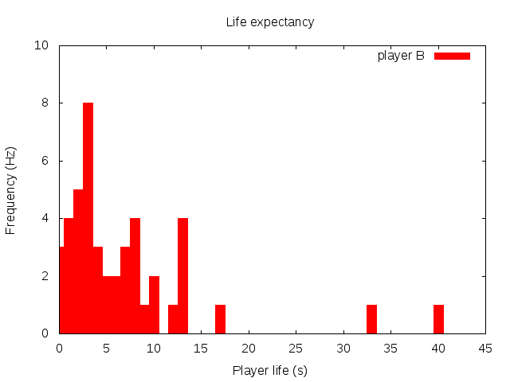
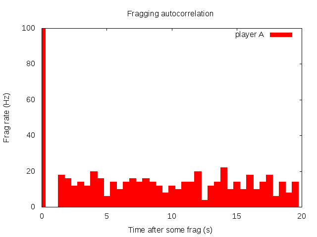
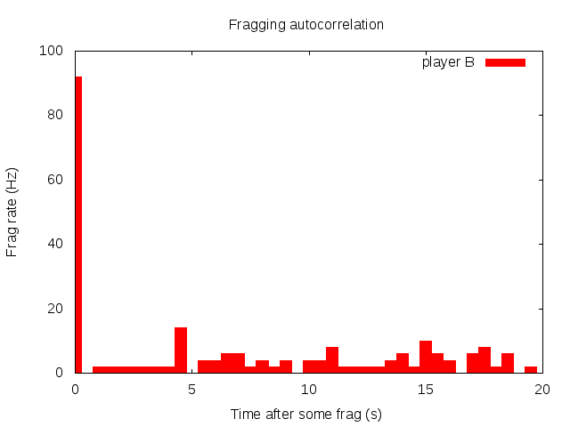
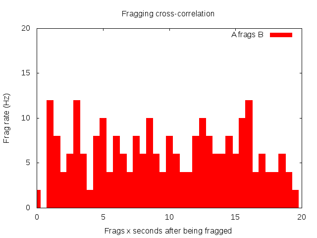
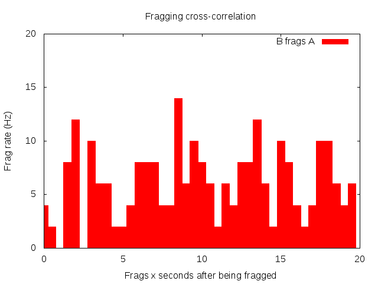

# tesserdata

Extracting statistics from a game of [tesseract](http://tesseract.gg).
Example data below is from a game between two players suggestively labelled 'A' and 'B'.

## tesserstamp

Records frag time stamps form tesseract stdout. Usage:
``` 	tesseract | tesserstamp > timestamps.txt  ```
Output: time stamp in ms, boolean indication if you got fragged.


## tesserrate

Extracts fragging rates during game progress. E.g., here player A got a bit tired near the end of the game.




## tesserhist

Makes a histogram of time between successive frags. E.g., here player A most often fragged one second after the previous frag. Intense game.





## tesserlife

Player's life expectancies. We were most likely to die after a few seconds. Surviving half a minute makes you a hero.




## tessercorr

Fragging autocorrelation: chance to frag delta t after some frag. Shows reload/respawn delay.




Fragging crosscorrelation: chance to frag detla t after being fragged.



